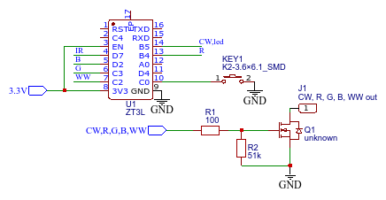

# tuyaLight - replacement firmware for TuYa LED controllers
This project intended to replace fitmware in TuYa TS0501B, TS0504B (and possible others) LED controllers.

## Why?
Because TuYa firmware sucks, that's why :)
But, seriously, not counting common drawbacks of TuYa devices firmware like manufacturer dependent messages and overall strange approach to zigbee standat, this devices have very annoying bug: sometimes, then device receive On command, it turn on light for few seconds and turned off. I was unable to find exact condition to trigger this bug, but it happens from time to time.
So, this project was born. 
This project based on sample from TeLink zigbee SDK.

## Improvements over original firmware
- Hardware button can be used as On/Off switch
- Working reporting with binding or hardware button
- Have a Power on behavior
- No more annoying bug with light goes off shortly afetr turn on (I hope)
- OTA updates

# Compilation
See [docs/sdk_installation.md](docs/sdk_installation.md)

# Flashing
See [docs/flash.md](docs/flash.md)

# OTA
See [docs/ota.md](docs/ota.md)

# Technical details
TuYa Zigbee LED controllers can be bought cheapely on Aliexpress. for example, [Here](https://www.aliexpress.com/item/1005005196855536.html). From hardware point of view, they all the same, at least TS0501B and TS0504B, and differs only by firmware and external connector to LED strip.
All controllers share same populated PCN and based on Tuya ZT3L module, which is based on Z2 chip - actually it is TeLink TLSR8258 (TLSR8258F1KAT32)

## Schematics
Actually, part of it. I was lazy enough to trace 3.3 voltage converter :)

# TODO

## Known devices and status:
- TS0501B single Work in progress, mostly working
- TS0502B CCT Not started
- TS0503B RGB Not started
- TS0504B RGBW Work in progress
- TS0505B RGB/CCT Not started

## Tasks
- [x] zigbee2mqtt converter
- [x] save state and power on control
- [x] reporting
- [x] OTA
- [ ] RGBW support
- [ ] Direct control of LED PWM using custom cluster
- [ ] Support of other controller types

